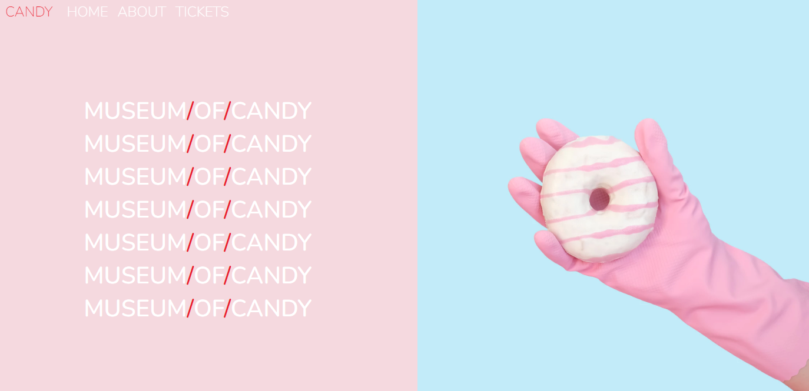

<h1 align="center"> Museum of Candy </h1>

Projeto utilizando Bootstrap

  
   <a href="#-screenshots">Screenshots</a>&nbsp;&nbsp;&nbsp;|&nbsp;&nbsp;&nbsp;
  <a href="#-technologies">Technologies</a>&nbsp;&nbsp;&nbsp;|&nbsp;&nbsp;&nbsp;
  <a href="#-features">Features</a>&nbsp;&nbsp;&nbsp;|&nbsp;&nbsp;&nbsp;
  <a href="#-project">Project</a>&nbsp;&nbsp;&nbsp;|&nbsp;&nbsp;&nbsp;
  <a href="#-license">License</a>&nbsp;&nbsp;&nbsp;|&nbsp;&nbsp;&nbsp;
  <a href="#-contributing">Contributing</a>&nbsp;&nbsp;&nbsp;|&nbsp;&nbsp;&nbsp;
  <a href="#support">Support</a>  

  

## 📸 Screenshots

 

  

 

## 🛠 Technologies

- HTML
- CSS
- JavaScript
- Bootstrap
- Git e GitHub

 

## ✨ Features

- [X] Page Integration;
- [X] Responsiveness;
- [X] Sticky navigation bar;
- [X] Smooth scrolling to anchor links
- [X] Responsive text;
- [X] Responsive buttons;

 

## 💻 Project

- The website was created to practice HTML, CSS, JavaScript and Bootstrap skills.

 

## 📜 License

* This project is licensed under the [MIT License](https://choosealicense.com/licenses/mit/)

 

## 🫱🏻‍🫲🏻 Contributing

 Contributions, issues, and feature requests are welcome! Please, feel free to do it! 😉 

 

## 🌟 Support

 If you like this project, please give it a star ⭐ and share it with others! 😄 

